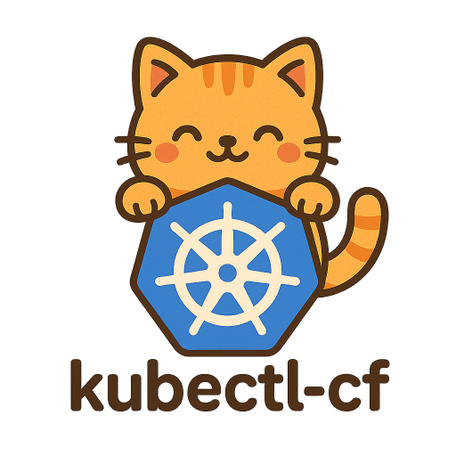

<div align="center">
  
</div>

[](https://goreportcard.com/report/github.com/junchaw/kubectl-cf)
[](https://github.com/junchaw/kubectl-cf/blob/main/LICENSE)
[](https://hub.docker.com/r/junchaw/kubectl-cf/)
[](https://github.com/junchaw/kubectl-cf/releases)

Faster way to switch between kubeconfig files.


```
Usage of kubectl-cf:

  cf           Select kubeconfig interactively
  cf [config]  Select kubeconfig directly
  cf -         Switch to the previous kubeconfig
```

##### # Take control of kubeconfig symlinks

`kubectl-cf` maintains kubeconfig symlinks for you,
and updates the symlink when you switch kubeconfig

##### # Respect `KUBECONFIG` environment variable

`kubectl-cf` respects the `KUBECONFIG` environment variable,
if it's set, `kubectl-cf` will use it as the kubeconfig file symlink.

##### # Grep kubeconfig files from multiple paths

By default, `kubectl-cf` reads kubeconfig files from the directory of the given kubeconfig file,
you can change this by setting the `KUBECTL_CF_PATHS` environment variable, for example:

```
# "@kubeconfig-dir" is a special path, it means the directory of the given kubeconfig file
export KUBECTL_CF_PATHS="~/.kube:~/another-kube-dir:~/yet-another-kube-dir:@kubeconfig-dir"
```

By default, `kubectl-cf` grep kubeconfig files with regex pattern `^(?P<name>(config)|([^\.]+\.yaml))$`,
you can change this by setting the `KUBECTL_CF_KUBECONFIG_MATCH_PATTERN` environment variable,
for example:

```
export KUBECTL_CF_KUBECONFIG_MATCH_PATTERN="^(?P<name>([^\.]+\.kubeconfig))$"
```

## Installation

### Install Manually

First, download tar file from the [release page](https://github.com/junchaw/kubectl-cf/releases).

After downloading the tar file, extract it, then put `kubectl-cf` in your `PATH`.
It can be called directly by typing `kubectl-cf`,
or as a [kubectl plugin](https://kubernetes.io/docs/tasks/extend-kubectl/kubectl-plugins/)
`kubectl cf`, because it has the `kubectl-` prefix.

You may want to set an alias for it, like `alias cf='kubectl cf'`.

## Translations

- [English](https://github.com/junchaw/kubectl-cf)

## TODO (PRs are welcomed)

- Auto completion;
- [krew](https://krew.sigs.k8s.io/) integration;
- Tests;

## References

- [kubekraken](https://github.com/junchaw/kubekraken): kubectl that operates multiple contexts concurrently;
- [kubectl-ctx](https://github.com/ahmetb/kubectx): switch between kubernetes contexts;
